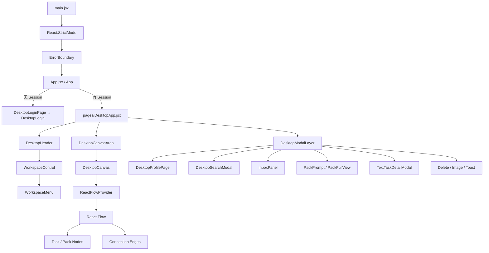
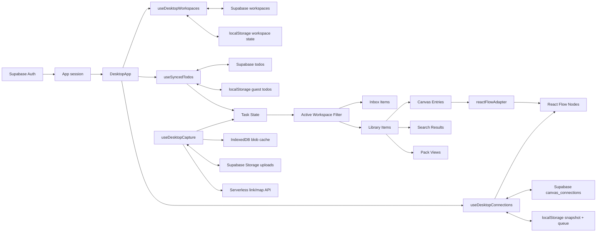

# IntoDay 前端系统总览（As-Is Architecture）

> 文档状态：As-Is
>
> 本文描述当前仓库中已经存在的实现，不包含目标架构或重构方案。除非特别标注为“推测的设计动机”或“待验证”，本文结论均来自当前代码。

## 1. Project Overview

### 1.1 产品定位与核心功能

IntoDay 是一个以 Desktop Workspace 为主界面的个人信息捕获与组织应用。登录后，用户围绕 Workspace、Canvas 和 Task 工作：

- **Workspace**：创建、选择、重命名、删除和恢复工作区。Task 通过 `desktopWorkspaceId` 归属到某个 Workspace。
- **Canvas**：以卡片和 Pack 的形式呈现内容，支持选择、拖拽、分组、拆分、连接和 Viewport 操作。
- **Task / Card**：统一承载文本、链接、视频、地点、音乐、图片、文档等内容。Card 的展示信息由 `getTaskCardPresentation()` 派生。
- **Inbox**：保存尚未放置到 Canvas 或 Pack 的内容，并支持把 Item 移到 Canvas 或目标 Pack。
- **Capture**：通过 Quick Add、文本、链接、剪贴板图片、文件选择和原生文件拖放创建内容。
- **Pack**：把多个 Task 组织为一个视觉分组，支持名称、图标、封面、标签、筛选、导出和 Full View。
- **Search**：搜索当前 Workspace 的 Library Task 和 Pack，并可从搜索结果继续打开或拖拽内容。
- **Connection**：在 Canvas 上连接 Pack；Connection 独立于 Task 数据存储。
- **Session 与 Profile**：Supabase 登录、登出、用户资料展示、语言选择和已删除 Workspace 恢复。

上述能力的主组合入口是 `src/pages/DesktopApp.jsx` 中的 `App({ session })`。Task 是当前系统的中心数据模型；Workspace、Inbox、Canvas、Pack 和 Upload 等功能都通过 Task 字段或 Task 集合与之关联。Task 的规范化入口是 `src/lib/taskNormalize.js` 中的 `normalizeTask()`。

### 1.2 技术栈与重要依赖

| 类别 | 当前实现 | 在系统中的作用 |
| --- | --- | --- |
| UI Framework | React 19、React DOM 19 | Component、Hooks、Lazy Loading、Error Boundary |
| Build Tool | Vite 7 | Development Server、HMR、Production Build |
| 语言 | JavaScript / JSX | 当前没有 `.ts`、`.tsx` 或 `tsconfig.json` |
| Canvas | `@xyflow/react` 12 | Node、Edge、Selection、Connect、Pan、Zoom 和 Viewport |
| Headless UI | Radix UI | Dialog、Alert Dialog、Dropdown、Popover、Tabs 和 Portal |
| Backend Client | `@supabase/supabase-js` | Authentication、PostgreSQL Data API、Storage |
| PWA | `vite-plugin-pwa` | Manifest、Service Worker、静态资源缓存 |
| 日期处理 | `date-fns` | 日期格式化与计算 |
| Export | JSZip | Pack 内容导出 |
| Icons / UI | Lucide React、项目内 SVG | UI 图标与品牌资源 |
| Analytics | Vercel Analytics、PostHog、自定义 Supabase Event | 使用情况记录 |
| Tests | Node.js `node:test` | 当前主要覆盖纯 Domain Logic |

依赖及脚本的权威来源是 `package.json`。Vite 的 React、PWA 和本地 Link Preview Middleware 配置位于 `vite.config.js`。

### 1.3 前端运行环境

IntoDay 当前是一个浏览器端 Single Page Application：

- `index.html` 提供唯一应用挂载点；
- `src/main.jsx` 通过 `createRoot()` 挂载 React；
- 应用没有使用 React Router；顶层页面由 Authentication State 在 Login 与 DesktopApp 之间切换；
- Production Build 输出到 `dist/`，`vercel.json` 将非 `/api/*` 请求回退到 `index.html`；
- Vite PWA 配置使用 `display: standalone`，因此应用可以作为 PWA 运行；
- UI 和交互依赖 DOM、Pointer Event、ResizeObserver、Clipboard、File、IndexedDB、LocalStorage 和 SessionStorage 等浏览器 API；
- `React.StrictMode` 在入口启用。Development 环境中 Effect 可能被 React 额外执行一次以检查副作用安全性；Production 不执行该开发期检查行为。

### 1.4 外部系统与本地存储

#### Supabase

`src/supabase.js` 中的 `getSupabaseSingleton()` 使用 `globalThis.__memotask_supabase_client__` 缓存一个 Supabase Client。只有 `VITE_SUPABASE_URL` 和 `VITE_SUPABASE_ANON_KEY` 都存在时才创建 Client。

当前代码使用 Supabase 的范围包括：

- **Auth**：Google OAuth、Email/Password、Session 查询、Auth State Subscription；
- **PostgreSQL**：`todos`、`workspaces`、`canvas_connections` 和 `user_analytics`；
- **Storage**：私有 `uploads` Bucket，Object Path 以用户 ID 开头；
- **RLS**：仓库内 Migration 为 Todos、Workspaces、Canvas Connections 和 Upload Objects 配置了用户级访问策略。

#### Browser Storage

浏览器存储不是单一 Cache，而是当前 Local-first 行为的一部分：

| 存储 | 主要内容 | 代码位置 |
| --- | --- | --- |
| `localStorage` | Guest Todos、Workspace、Active Workspace、Deleted Workspace、Connection Snapshot、Pending Connection Operations、Migration Flags、Language | `useSyncedTodos.js`、`useDesktopWorkspaces.js`、`connectionStorage.js`、`language.js` |
| `sessionStorage` | Search/Profile Open Flag | `useDesktopSearch.js`、`useDesktopSession.js` |
| IndexedDB | 上传文件的本地 Blob Cache | `src/shared/storage/uploadedFileStorage.js` |

对于已登录用户，Todos、Workspaces 和 Connections 的长期权威数据来自 Supabase；浏览器存储仍承担 Migration、离线 Snapshot、Pending Operation 或本地文件回退等职责。

#### Serverless API

仓库中存在两个 Vercel Serverless Handler：

- `api/link-preview.js`：抓取 URL Metadata、处理部分 oEmbed 和页面信息；
- `api/resolve-map-url.js`：解析短 Google Maps URL 的最终地址。

前端通过 `src/entities/task/model/taskCardPresentation.js` 中的 `fetchLinkPreviewMeta()` 和 `fetchMapMeta()` 调用这些接口。`vite.config.js` 在本地 Development Server 中只显式挂载了 `/api/link-preview` Middleware；`resolve-map-url` 在纯 Vite 开发环境中的可用性依赖外部运行方式，代码本身提供了公共 Proxy Fallback。该本地行为是否在所有开发方式中一致，**待验证**。

## 2. Application Entry & Lifecycle

### 2.1 从入口到主界面

1. 浏览器加载 `index.html` 和 Vite Bundle。
2. `src/main.jsx` 首先加载 Design Tokens、Global CSS、Desktop CSS、React Flow CSS 和各 Feature CSS。
3. `createRoot(document.getElementById('root'))` 挂载：
   - `React.StrictMode`
   - `ErrorBoundary`
   - `App`
4. `src/App.jsx` 中的 `App()` 初始化 Analytics 和 Authentication State。
5. Authentication 尚未完成时渲染 `DesktopAuthLoading`。
6. 没有 Session 时渲染 `DesktopLoginPage`；它重新导出 `DesktopLogin`。
7. 有 Session 时渲染 `<DesktopApp key={session.user.id} session={session} />`。
8. `DesktopApp` 组合 Workspace、Task、Inbox、Canvas、Connection、Capture、Pack、Search 和 Modal 等 Feature。

`session.user.id` 被用作 `DesktopApp` 的 React `key`。用户变化时 React 会卸载旧 DesktopApp 并挂载新的实例，从而重置其 Local State 和 Hook 生命周期。

### 2.2 Authentication 初始化

Authentication 的第一层入口是 `src/App.jsx` 中的 `App()`：

1. 初始 State：`session = null`、`loadingAuth = true`；
2. `initializePostHogWhenIdle()` 在 Idle Callback 或 Timeout 中延迟加载 PostHog；
3. Auth Effect 设置 5 秒 Timeout，避免 Session 查询永久阻塞 Loading；
4. Supabase 未配置时立即结束 Loading；
5. Supabase 可用时调用 `supabase.auth.getSession()`；
6. 同时注册 `supabase.auth.onAuthStateChange()`；
7. Auth Event 更新 `session`，并调用 `identifyPostHogUser()` 或 `resetPostHogUser()`；
8. Effect Cleanup 取消 Timeout 和 Auth Subscription。

登录页由 `src/DesktopLogin.jsx` 实现：

- `handleGoogleLogin()` 调用 `signInWithOAuth()`；
- `handlePasswordLogin()` 调用 `signInWithPassword()`；
- 登录成功后不直接导航，而是由顶层 Auth Subscription 收到 Session 后切换到 DesktopApp。

当前 `src/features/session/hooks/useDesktopSession.js` 在 DesktopApp 内部还会第二次调用 `getSession()` 并注册 Auth Subscription。`DesktopApp` 使用 `user || session?.user` 计算 `currentUser`。这是当前 As-Is 行为，不代表推荐的目标设计。

### 2.3 登录后的模块初始化

`DesktopApp` 首次 Render 时，Custom Hooks 按源码顺序被调用，但其中的异步 Effect 在 Commit 后各自启动；Workspace、Todo、Connection 和 Session 的远程加载不是一个严格串行 Pipeline。

关键过程如下：

1. `useDesktopSession()` 创建 Session、Language、Profile UI State；
2. `currentUser` 优先使用 `useDesktopSession().user`，否则使用从 `App` 传入的 `session.user`；
3. `useDesktopWorkspaces({ userId })` 初始化 Workspace State；
4. `useWorkspaceControl()` 初始化 Workspace Menu 和 Rename UI State；
5. `useSyncedTodos({ userId, normalizeTodo })` 初始化 Task Store；
6. `useInboxData(activeWorkspaceTasks)` 派生 Inbox 与 Library；
7. `useCanvasEntries({ currentWorkspaceTasks })` 将 Library Tasks 派生为 Canvas Entries；
8. Drag、Selection、Search、Inbox Panel、Viewport 等 Hook 初始化 Local State 和 Ref；
9. `useDesktopConnections()` 根据 User 和 Active Workspace 加载 Connection；
10. Capture、Task Actions、Text Detail 和 Pack Actions 组合到统一交互流程；
11. `useUploadedFileLifecycle({ tasks })` 开始观察 Task 中的本地文件引用；
12. `useDesktopSession().loading` 为 `false` 后，DesktopApp 才渲染 Header、Canvas 和 Modal Layer。

需要注意：虽然 DesktopApp 在 Session Hook Loading 时返回 Spinner，但 React 仍必须先执行该 Render 中声明的所有 Hooks。因此 Workspace、Task 等 Hook 已经被实例化，它们的 Effect 可以在主 UI 显示之前开始加载数据。

### 2.4 主要数据何时加载

#### Workspace

`useDesktopWorkspaces()` 在有 `userId` 时初始使用空数组，并在 Effect 中：

1. 读取 User-scoped Local Workspace；
2. 请求 `loadCloudWorkspaces()`；
3. 必要时执行 Legacy Workspace Migration；
4. 再次加载 Active 和 Deleted Cloud Workspaces；
5. 恢复 LocalStorage 中记录的 Active Workspace ID，或回退到第一个 Workspace。

#### Task

`useSyncedTodos()` 在已登录用户场景初始使用空数组，并在 Hydration Effect 中：

1. 重置当前 Task Snapshot；
2. 调用 `loadCloudTodos()`；
3. 检查 Legacy Migration；
4. 再次读取 Cloud Todos；
5. 更新 `todosRef`、React State 和 `cloudLoaded`。

Task 后续通过两条路径持久化：

- `setTodos()`：先更新本地 State，记录变化，600ms 后增量同步；
- `commitTodos()`：进入 Promise Queue，先持久化完整 Snapshot，再更新 State。

Window Focus 或 Document 再次 Visible 时，Hook 会在没有正在同步且最近没有本地修改的前提下刷新 Cloud Todos。

#### Connection

`useDesktopConnections()` 以 `ownerId + workspaceId` 为 Scope：

- Guest 或 Cloud Sync 关闭时直接从 LocalStorage 加载；
- 已登录时从 Supabase 加载，并在符合条件时迁移本地 Connection；
- 本地修改先写入 React State 和 LocalStorage；
- Cloud Operation 进入 Pending Queue；
- `online` 和 `focus` Event 会触发 Retry 与 Cloud Refresh。

#### Uploaded File

创建上传 Task 时，`useDesktopCapture()` 先创建本地 Task 和本地预览，然后异步上传到 Supabase Storage。上传成功后把 `uploadedFileStoragePath` 写回 Task；失败时保留本地文件并设置失败状态。

### 2.5 Loading、Error 与 Unmount

#### Loading

- `App` 使用 `DesktopAuthLoading` 表示顶层 Session 查询；
- `DesktopApp` 使用独立 Spinner 表示 `useDesktopSession` 查询；
- 文件导入、Quick Add、Clipboard、Pack Export 等功能在各自组件内维护局部 Loading State；
- Profile、Search 和 Pack Full View 通过 `React.lazy()` 加载，当前 `Suspense fallback` 为 `null`。

#### Error

- `ErrorBoundary` 捕获 Descendant Render/Lifecycle Error，记录到 Console，并展示 Reload Application；
- Auth、Workspace、Todo、Connection 和 Upload 的异步错误主要通过 Console、Toast、Local Fallback 或 Retry 处理；
- ErrorBoundary 不会捕获普通 Event Handler 或异步 Promise 中未转化为 Render Error 的异常；这些错误由各 Hook 自己处理。

#### Unmount 与 Cleanup

当前关键 Cleanup 包括：

- `App`：取消 Auth Timeout、Auth Subscription 和待执行的 PostHog Initialization；
- `useDesktopSession`：取消第二个 Auth Subscription 和 Timeout；
- `useSyncedTodos`：设置 Hydration Cancellation Flag、清理 Autosync/Retry Timer、移除 Focus 和 Visibility Listener；
- `useDesktopConnections`：设置 Cancellation Flag，移除 Online 和 Focus Listener；
- `useDesktopViewport`：取消 Animation Frame、断开 ResizeObserver、移除 Resize Listener；
- `DesktopCanvas`：卸载时清空向上暴露的 React Flow Instance Ref；
- Canvas Drag Hooks：清理 Animation Frame、Pointer Capture 相关状态和 Body Class；
- `GlobalStyles`：移除动态插入的 Font Link 和 Style Element。

部分异步请求无法真正取消，代码主要通过 `cancelled` / `isActive` Flag 避免在 Unmount 后写入 State。

## 3. Project Structure

以下目录树反映当前仓库的架构相关结构。`node_modules/`、`dist/`、`dev-dist/`、临时目录和图片资源等生成内容被省略。

```text
intoday-main/
├── api/
│   ├── link-preview.js
│   └── resolve-map-url.js
├── docs/
│   └── architecture/
│       └── 01-system-overview.md
├── public/
├── src/
│   ├── main.jsx
│   ├── App.jsx
│   ├── DesktopLogin.jsx
│   ├── DesktopLogin.css
│   ├── supabase.js
│   ├── userProfile.js
│   ├── assets/
│   ├── components/
│   │   ├── ErrorBoundary.jsx
│   │   ├── IntoDayLogo.jsx
│   │   ├── DesktopHistoryModal.jsx
│   │   └── DesktopProfilePage.jsx
│   ├── pages/
│   │   ├── DesktopApp.jsx
│   │   ├── DesktopLoginPage.jsx
│   │   └── components/
│   │       ├── DesktopHeader.jsx
│   │       ├── DesktopCanvasArea.jsx
│   │       └── DesktopModalLayer.jsx
│   ├── entities/
│   │   ├── task/
│   │   │   ├── data/useSyncedTodos.js
│   │   │   ├── model/taskCardPresentation.js
│   │   │   └── taskLayoutConstants.js
│   │   └── pack/model/
│   │       ├── packSelectors.js
│   │       └── packValueNormalizers.js
│   ├── features/
│   │   ├── canvas/
│   │   │   ├── adapters/
│   │   │   ├── components/
│   │   │   ├── data/
│   │   │   ├── hooks/
│   │   │   ├── model/
│   │   │   ├── styles/
│   │   │   ├── tests/
│   │   │   └── index.js
│   │   ├── capture/
│   │   │   ├── components/
│   │   │   ├── config/
│   │   │   ├── hooks/
│   │   │   ├── services/
│   │   │   ├── styles/
│   │   │   └── index.js
│   │   ├── inbox/
│   │   │   ├── components/
│   │   │   ├── hooks/
│   │   │   ├── model/
│   │   │   ├── styles/
│   │   │   ├── tests/
│   │   │   └── index.js
│   │   ├── pack/
│   │   │   ├── components/
│   │   │   ├── hooks/
│   │   │   ├── model/
│   │   │   ├── services/
│   │   │   ├── styles/
│   │   │   ├── tests/
│   │   │   └── index.js
│   │   ├── search/
│   │   ├── session/
│   │   ├── task-detail/
│   │   └── workspace/
│   ├── hooks/
│   │   └── useDesktopTaskActions.js
│   ├── lib/
│   ├── shared/
│   │   ├── config/
│   │   ├── i18n/
│   │   ├── lib/
│   │   ├── storage/
│   │   └── ui/
│   ├── styles/
│   │   ├── tokens.css
│   │   ├── index.css
│   │   └── desktop.css
│   └── task-interactions/
├── supabase/
│   ├── config.toml
│   └── migrations/
├── index.html
├── package.json
├── vercel.json
└── vite.config.js
```

### 3.1 目录职责

#### `pages/`

页面级组合层。它负责决定页面由哪些 Feature 构成，以及 Feature 之间如何通信。

- `DesktopApp.jsx` 是主 Composition Root；
- `DesktopHeader`、`DesktopCanvasArea` 和 `DesktopModalLayer` 是页面区域组件；
- Pages 可以依赖多个 Features，但 Feature 不应依赖 Page。

#### `features/`

按用户可感知的业务功能组织代码。Feature 通常包含：

- `components/`：功能 UI；
- `hooks/`：功能 State、Effect 和 Use Case；
- `model/`：纯业务规则和 State Transition；
- `data/`：Repository、本地存储与 Cloud Sync；
- `services/`：文件、网络、导出等过程式能力；
- `styles/`：Feature CSS；
- `tests/`：以纯逻辑为主的测试；
- `index.js`：部分 Feature 的 Public API。

#### `entities/`

围绕跨 Feature 使用的核心领域对象组织代码。目前主要是 Task 与 Pack：

- Task 的同步 Store、Card Presentation；
- Pack 的 Selector 和 Value Normalizer。

该层已经出现，但尚未覆盖全部领域逻辑；部分 Task/Workspace 逻辑仍在 `lib/`。

#### `shared/`

不属于单一 Feature 的基础能力：

- 配置常量；
- 国际化文案；
- Analytics；
- User-scoped Storage；
- 通用 UI、Icon 和 Portal；
- IndexedDB 文件存储。

#### `hooks/`

根级 `hooks/` 当前只有 `useDesktopTaskActions.js`，承担跨 Task、Upload、Task Detail、Analytics 和 Canvas Selection 的应用级操作。它与 Feature Hook 的区别主要是跨 Feature，而不是技术形式不同。

#### `lib/`

历史形成的通用函数和领域辅助代码，包括 Task Detection、Normalization、Date、Workspace、URL 和 Layout 逻辑。它同时包含真正通用工具与部分 Domain Logic，因此当前边界比 `shared/` 和 `entities/` 更宽。

#### `components/`

根级组件主要保存跨页面组件、Error Boundary 和兼容性 Re-export。`DesktopHistoryModal.jsx` 与 `DesktopProfilePage.jsx` 当前只是转发到对应 Feature Component。

### 3.2 当前架构组织模式

IntoDay 当前采用混合模式：

- **Feature-Based Organization**：业务能力按 Feature 聚合；
- **Component-Based UI**：页面通过 React Component 组合；
- **Container / Presentational Split**：DesktopApp 负责协调，Header/CanvasArea/ModalLayer 以 Props 驱动；
- **Custom Hook Controller**：Hook 管理 State、Effect 和 Application Interaction；
- **Functional Domain Model**：Canvas Drop、Collision、Inbox Placement 和 Pack Merge 尽量使用纯函数；
- **Repository / Service**：数据访问和外部过程从 UI 中分离；
- **Local-first Synchronization**：本地 State 先响应，再与 Supabase 同步。

它不是严格执行某一种公开架构规范，而是一个以 `DesktopApp` 为 Composition Root、以 Feature 为主要模块边界的渐进式前端架构。

## 4. Architecture Overview

### 4.1 DesktopApp 的职责

`src/pages/DesktopApp.jsx` 同时承担三种作用：

1. **Composition Root**：实例化各 Feature Hook 并渲染页面区域；
2. **State Owner**：持有 Toast、Delete Confirmation、Pack Prompt、Fullscreen Image 等跨区域 UI State；
3. **Application Coordinator**：协调 Inbox → Canvas、Pack Merge → Connection Rewire、Workspace Delete → Task Archive 等跨 Feature 流程。

核心 Task State 并不直接由 `useState` 写在 DesktopApp，而由 `useSyncedTodos()` 提供。DesktopApp 对其进行 Workspace Filter，再派生 Inbox、Library 和 Canvas Entry。

### 4.2 Header、Canvas 与 Modal 的关系

- **DesktopHeader**：读取 Workspace、Inbox Count 和 User Profile；通过 Callback 请求打开 Search、Inbox、Profile 或修改 Workspace。
- **DesktopCanvasArea**：负责 Canvas 的页面布局、文件 Drop Zone 和 Drag Overlay；将交互委托给 DesktopCanvas。
- **DesktopCanvas**：React Flow Adapter，负责 Domain Entry 与 React Flow Node/Edge 之间的转换。
- **DesktopModalLayer**：统一挂载 Profile、Search、Inbox、Pack、Task Detail、Delete Dialog、Toast 和 Fullscreen Image。

三者不直接互相读写 State；通信通常经过 DesktopApp：

```text
Header / Modal event
        ↓ callback
    DesktopApp
        ↓ state / props
Canvas / Modal / Header update
```

对于高频 Drag，DesktopApp 组合的 Drag Runtime 使用 Ref 和 Hook Bridge，避免每个 Pointer Move 都经过普通业务 State。

### 4.3 Feature Hooks 的作用

Feature Hook 是当前 UI 与 Domain/Data 层之间的主要 Controller：

- `useDesktopWorkspaces`：Workspace State、Cloud Hydration、Mutation；
- `useWorkspaceControl`：Menu 和 Rename UI State；
- `useSyncedTodos`：Task Store 和 Local/Cloud Sync；
- `useInboxData`：Inbox/Library Selector；
- `useInboxPlacement`：Inbox Placement Use Case；
- `useCanvasEntries`：Task → Canvas Entry Selector；
- `useDesktopTaskDrag`：组合完整 Drag Workflow；
- `useDesktopConnections`：Connection State 和持久化；
- `useDesktopCapture`：Capture、Upload、Metadata 和 File Open；
- `usePackActions`：Pack Metadata、Open、Merge 和 Prompt；
- `useTextTaskDetail` / `useTextTaskPersistence`：Text Detail UI 与保存。

Hook 的作用不是单纯“复用 React 代码”。它们也定义了 Feature 对外暴露的 State 和 Commands。

### 4.4 Domain Model、Repository 与 Service

#### Domain Model

Domain Model 表达不依赖 React Render 的规则、转换和决策。例如：

- `decideCanvasDrop()`：把 Drag Context 转换为 Drop Decision；
- `reduceCanvasDrop()`：将 Drop Action 应用到 Task 集合；
- `resolveDesktopCanvasEntries()`：将 Task 集合投影为 Canvas Entry；
- `placeInboxItem()`：把 Inbox Task 转为 Library Task；
- Pack Metadata Selector 和 Normalizer。

这些函数多数可以通过输入/输出直接测试。

#### Repository / Data

Repository 知道数据存储位置和远端 Schema，负责数据映射与 CRUD：

- `workspaceRepository.js`：Supabase Workspaces；
- `connectionRepository.js`：Supabase Canvas Connections；
- `connectionStorage.js`：Connection Local Snapshot 和 Pending Queue。

`useSyncedTodos()` 当前同时承担 Hook 和 Task Repository/Sync Engine 的职责，因此并非所有实体都具有完全独立的 Repository 文件。

#### Service

Service 封装外部过程或基础设施行为：

- `uploadStorage.js`：Supabase Storage Upload、Download、Signed URL；
- `uploadedTaskFactory.js`：从 File 创建 Task；
- `clipboardUtils.js`：读取和规范化 Clipboard Image；
- `packExport.js`：Pack 文件导出；
- Serverless Link Preview / Map Resolve。

### 4.5 React Flow 的集成位置

React Flow 被限制在 Canvas Feature：

- `DesktopCanvas.jsx` 创建 `ReactFlowProvider` 和 `ReactFlow`；
- `reactFlowAdapter.js` 负责 Domain Entry/Connection 与 Node/Edge 的转换；
- `reactFlowNodeTypes.js` 和 `reactFlowEdgeTypes.js` 注册自定义类型；
- `useDesktopViewport` 使用 React Flow Instance 的 `screenToFlowPosition()`；
- `useDesktopTaskDrag` 把 React Flow Node Drag 和项目内部 Drag Workflow 汇合；
- Domain Model 不直接依赖 React Flow Event Object，主要接收转换后的 Position、Entry 和 Action。

这使 React Flow 负责基础 Canvas Engine，而业务规则仍保留在项目的 Model 和 Hook 中。

### 4.6 Supabase 的集成位置

Supabase Client 从 `src/supabase.js` 导出。主要调用点为：

- Auth：`App.jsx`、`DesktopLogin.jsx`、`useDesktopSession.js`；
- Task：`useSyncedTodos.js`；
- Workspace：`workspaceRepository.js`；
- Connection：`connectionRepository.js`；
- File：`uploadStorage.js`；
- Analytics：`shared/lib/analytics.js`。

UI Component 通常不直接查询数据库；主要例外是 Login Component 直接调用 Auth，这是 Authentication UI 的当前实现方式。

## 5. High-Level Architecture Diagram

### 5.1 整体组件关系图



### 5.2 系统数据流向图



### 5.3 Application Initialization Sequence Diagram

```mermaid
sequenceDiagram
    autonumber
    participant Browser
    participant Main as main.jsx
    participant App as App.jsx
    participant Auth as Supabase Auth
    participant Desktop as DesktopApp
    participant Session as useDesktopSession
    participant Workspaces as useDesktopWorkspaces
    participant Todos as useSyncedTodos
    participant Connections as useDesktopConnections
    participant DB as Supabase Data API

    Browser->>Main: Load bundle and global CSS
    Main->>App: Mount inside StrictMode and ErrorBoundary
    App->>App: Start PostHog idle initialization
    App->>Auth: getSession()
    App->>Auth: onAuthStateChange subscribe
    App-->>Browser: Render DesktopAuthLoading

    Auth-->>App: Session or null
    alt No session
        App-->>Browser: Render DesktopLoginPage
    else Authenticated session
        App->>Desktop: Mount with session and user-key
        Desktop->>Session: Initialize session/language/profile hook
        Desktop->>Workspaces: Initialize with currentUser.id
        Desktop->>Todos: Initialize with currentUser.id
        Desktop->>Connections: Initialize current workspace scope
        Desktop-->>Browser: Render Desktop session loading UI

        par Session refresh
            Session->>Auth: getSession() and subscribe again
            Auth-->>Session: Current user
        and Workspace hydration
            Workspaces->>DB: Load active/deleted workspaces
            DB-->>Workspaces: Workspace rows
        and Todo hydration
            Todos->>DB: Load non-deleted todos
            DB-->>Todos: Todo payload rows
        and Connection hydration
            Connections->>DB: Load workspace connections
            DB-->>Connections: Connection rows
        end

        Session-->>Desktop: loading = false
        Workspaces-->>Desktop: workspace state updates
        Todos-->>Desktop: task state updates
        Connections-->>Desktop: connection state updates
        Desktop-->>Browser: Render Header, Canvas and Modal Layer
    end

    Note over Desktop,Connections: Remote data effects are independent; the diagram shows logical concurrency, not a guaranteed network completion order.
```

## 6. Important Architectural Decisions

当前仓库没有 Architecture Decision Record，因此不能确认最初决策者的历史理由。以下内容严格区分“代码可以证明的作用”和“从实现推测的动机”。

### 6.1 Feature-Based 目录

**现有实现的作用**

- Workspace、Canvas、Inbox、Capture、Pack、Search、Session 和 Task Detail 各自聚合 Component、Hook、Model、Data、Service、Style 和 Test；
- 部分 Feature 通过 `index.js` 提供 Public API；
- 页面层从多个 Feature 组合完整 Workspace。

**Why**

- 可以确认的原因：功能代码需要共享内部 Model 和 Hook，而不同功能具有明显不同的 UI 与交互生命周期；按 Feature 聚合能让相关代码物理接近。
- 推测的设计动机：项目很可能从较集中的 Desktop Component 逐步拆分而来，Feature 目录用于控制功能增长后的修改范围。仓库存在多个 Architecture Handoff 文档支持“渐进拆分”这一背景，但本文不把它视为正式 ADR。

### 6.2 Custom Hooks

**现有实现的作用**

- 将 State、Effect、Ref 和 Command 从 JSX 中抽离；
- 组合复杂交互，例如 Canvas Drag；
- 包装数据生命周期，例如 Workspace、Todo 和 Connection Hydration；
- 为 Component 暴露受控 API。

**Why**

- React Component 仍负责 Render，而 Hook 可以管理与 Render 相关但不应写入 JSX 的状态和副作用；
- Canvas 高频交互需要共享大量 Ref 和 Callback，Hook 能在不引入全局 Store 的前提下组织这些能力。

历史上是否曾比较过其他状态管理方案，**待验证**。

### 6.3 React State + Props

**现有实现的作用**

- `DesktopApp` 是主要 State Coordination Point；
- Header、CanvasArea、ModalLayer 和 Feature Component 通过 Props 接收 State，通过 Callback 请求修改；
- Local UI State 留在最接近的 Component 或 Hook 中；
- 没有 Context、Redux 或 Zustand。

**Why**

- 当前主界面是单一 DesktopApp Tree，共享状态多数只需经过 1–3 层；
- 显式 Props 让 Feature 依赖可见；
- Canvas 高频数据通过 Ref 优化，而不是放入全局 Store。

“团队明确决定不采用全局 Store”这一历史结论无法从代码确认。

### 6.4 React Flow

**现有实现的作用**

React Flow 提供：

- Node/Edge Render；
- Viewport、Zoom、Pan；
- Selection；
- Node Drag Event；
- Connection Handle 与 Edge Interaction；
- Screen Coordinate 到 Flow Coordinate 转换。

IntoDay 自己保留：

- Task/Pack Domain Entry；
- Group/Pack 业务规则；
- Collision、Drop Decision 和 Drop Reducer；
- Inbox/Search 外部拖入；
- Connection Domain Model 和持久化。

**Why**

- 可以确认的作用是将基础 Canvas Engine 交给成熟库，同时保留产品特有的 Domain Behavior；
- 选择 React Flow 相对于其他 Canvas Library 的历史比较过程，代码无法证明，**待验证**。

### 6.5 Local-first Sync

**现有实现的作用**

- Task 的多数操作先更新 React State，再延迟同步；
- Connection 修改先写本地 Snapshot 和 Pending Queue，再同步 Cloud；
- Upload 先创建本地 Task 和 Preview，再异步上传 Binary；
- 网络失败时部分功能保留本地数据并 Retry；
- Focus、Visibility 或 Online Event 触发 Refresh/Retry。

**Why**

- Canvas Drag、Selection、Pack 操作需要立即反馈，不能等待网络往返；
- 上传文件和 Metadata 抓取可能较慢，不应阻塞 Task 出现在 UI；
- 浏览器存储可以作为 Migration、离线和临时故障的缓冲层。

当前代码没有完整定义 Offline Product Contract，例如离线创建后何时视为成功、跨设备冲突如何解决。因此“支持完整 Offline Mode”不能从代码确认。

## 7. Known Limitations

本节只记录理解当前系统时必须知道的限制，不在此处设计解决方案。后续详细问题、影响、证据和重构优先级应记录在 [`07-current-issues.md`](./07-current-issues.md)；该文档当前尚未创建。

- `App` 与 `useDesktopSession` 都会查询和订阅 Supabase Auth，Authentication 存在两个 State Source。
- `DesktopApp` 同时是 Composition Root 与跨 Feature Workflow Coordinator，Feature 间通信高度集中于该文件。
- Task 是 Workspace、Canvas、Inbox、Pack、Card Metadata 和 Upload 的共同宽数据模型。
- Pack 当前不是独立实体；Pack Metadata 被复制到组内 Task。
- `setTodos()` 与 `commitTodos()` 具有不同持久化语义，异步并发边界较复杂。
- Workspace 删除/恢复同时涉及 Workspace 与 Task 两个数据域，但当前没有统一事务。
- Canvas、Pack、Inbox 和 Capture 存在跨 Feature 双向依赖。
- `taskCardPresentation.js` 同时包含 Presentation Logic 和 Remote Metadata Fetch。
- 已有测试主要覆盖纯 Domain Logic；Hook、Component、Auth、Sync 和跨 Feature Integration 覆盖有限。
- Feature CSS 由 `main.jsx` 全局加载，当前依靠命名前缀而非 CSS Module 隔离。
- 当前使用 JavaScript/JSX，没有编译期类型约束；复杂对象主要依赖约定和 Runtime Normalization。
- Serverless API、外部 Proxy、PWA Cache 与真实 Production Deployment 的完整故障行为仍需在部署环境进一步验证。

---

本文是 IntoDay Architecture Documentation 的第一份 As-Is 文档。后续文档在引用本文件时，应以当前源码为最终依据，并在系统行为变化后同步更新本文件。
